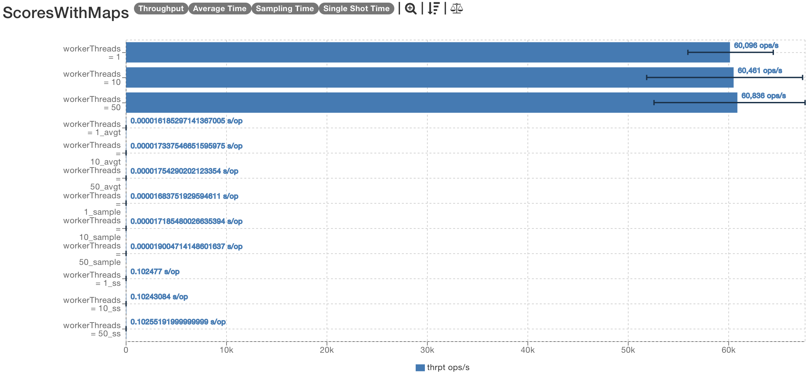
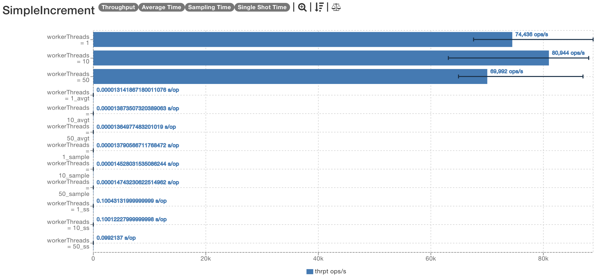

# Performance Analysis
## 1. Introduction
 The goal of Meteor is to make your networked application easier, not a pain. Meteor is designed to be as easy as possible to use, but also to be performant.
 This document will go over the performance overhead incurred from Meteor remote invocations, how to optimize your application and other possible hurdles to consider.

## 2. Testing Environment
The benchmarks presented here have been run on a `Ryzen 7 3700x 32gb ddr4 3200mhz`, and the results are the average of 5 runs (with 5 warmup runs per test). The benchmarks themselves are based on [OpenJDK's JMH](https://github.com/openjdk/jmh) and you can run them yourself through within the `benchmarks` folder.

All tests have been run with a local loopback configuration. This means that all 'packets' have been locally evaluated and no network overhead has been incurred, however, serialization and deserialization overhead is still present.

Invocation time is therefore not fully representative of a real-world scenario, but it is still a good indicator of the overhead incurred by Meteor.
If you want a more realistic benchmark, you can run the tests with a remote configuration (like redis), or imagine adding your network RTT (round-trip time) to each invocation time.

All benchmarks have been run with 1, 10 and 50 worker threads. This means that the meteor receiver was able to process 1, 10 and 50 invocations concurrently.
Keep an eye on the results for the 1 thread case, as it is more representative of implementations where locking is used. The 10 and 50 thread cases are more representative of implementations where resources are not shared between threads.

## 3. Benchmarks
### 3.1 Map Based Datatypes
This benchmark simulates a simple key-value store, where the initial invocation contains a String and an Integer, and the entire map is returned.
The map is then updated with a new key-value pair, and simulates a more complicated datatype being returned.

### 3.2 Small Invocation
This benchmark simulates a remote integer being incremented and returned. It does not take any arguments, and therefore represents a scenario benchmark of Meteor logic without adapting any types or processing method overloads.
