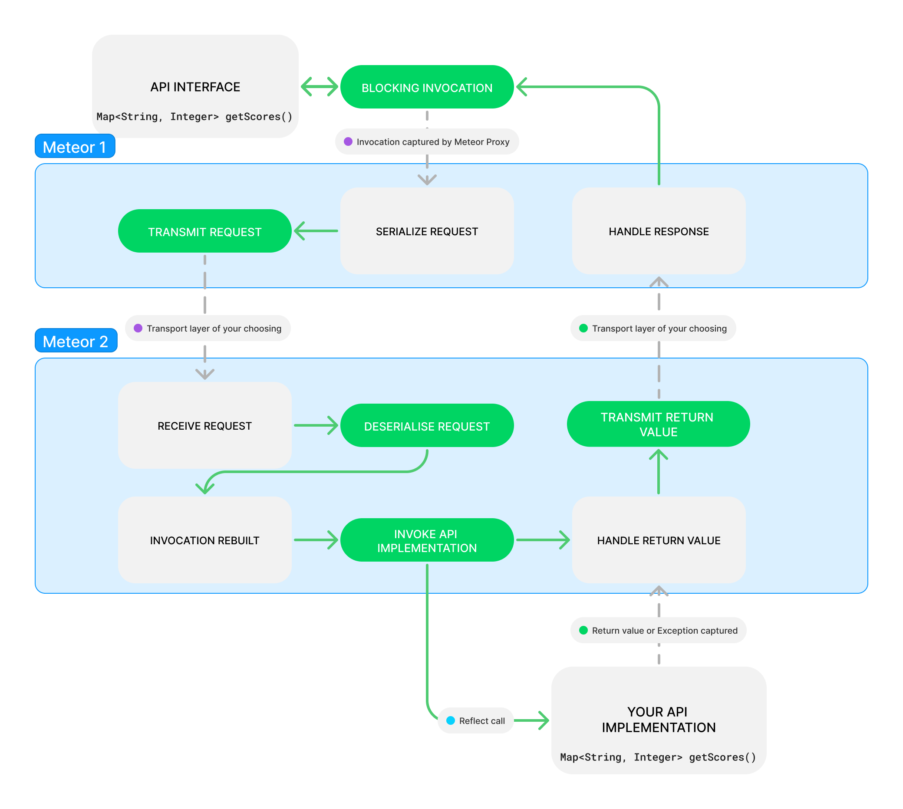

<p align="center">

</p>

# Meteor
> A general-purpose Java RPC library that plugs in like magic

Meteor is designed to fill the (physical) gap between application instances and remote services where applications need to interface with a service that may be available locally or be provided by a remote JVM instance.
It allows you to write your application against your interface as if it's local code and either supply the implementation locally (like you would with any other interface) or tunnel it through a transport layer (like Redis), without needing to design API specifications or write any networking logic.

<p align="center">

</p>


# Usage
Let's say that you have an interface like this;
```java
public interface Scoreboard {
    int getScoreForPlayer(String player);
    void setScoreForPlayer(String player, int score);
    Map<String, Integer> getAllScores();
}
```

with the following normal implementation
```java
public class ScoreboardImplementation implements Scoreboard {

    private final Map<String, Integer> scores = new HashMap<>();

    @Override
    public int getScoreForPlayer(String player) {
        return scores.getOrDefault(player, 0);
    }

    @Override
    public void setScoreForPlayer(String player, int score) {
        scores.put(player, score);
    }

    @Override
    public Map<String, Integer> getAllScores() {
        return scores;
    }
}
```

Then you can use your own implementation instance within your application, or share it with external applications by registering it as an implementation, for this example, we'll give it a namespace so we can have multiple scoreboards for each game mode.

```java
Meteor meteor = new Meteor(new RedisTransport("localhost", 6379, "scoreboard-sync"));
meteor.registerImplementation(new ScoreboardImplementation(), "parkour-leaderboard");
```

and we can obtain an instance of this scoreboard from any other process by requesting a procedure class
```java
Meteor meteor = new Meteor(new RedisTransport("localhost", 6379, "scoreboard-sync"));
Scoreboard parkourScoreboard = meteor.registerProcedure(Scoreboard.class, "parkour-leaderboard");
```

and that's it! `parkourScoreboard` is a dynamically generated implementation of the Scoreboard class, mapping to our `ScoreboardImplementation` running in the other process. All methods are blocking and function *exactly* like they would if you're calling them on a local instance. This allows you to run a single instance if you want, or easily scale your code across multiple processes without having to worry about any of the details.

**[View example code with a local loopback](https://github.com/MeteorMsg/Meteor/blob/main/examples/src/main/java/com/meteormsg/sender/ScoreboardExample.java)**

# Parameters
- *RpcTransport* transport - The transport to use for this Meteor instance (see below, also open to own implementations)
- *RpcSerializer* serializer - The serializer to use for this Meteor instance (Defaults to a Gson based generic, open to own implementations)
- *RpcOptions* options
    - *int* threadPoolSize - The size of the thread pool to use for invocations (defaults to 1)
    - *int* invocationTimeout - The timeout for invocations (defaults to 30 seconds)
    - *ClassLoader* classLoader - The classloader to use for dynamically generated classes (defaults to the current thread's context classloader)

# Transport Options
Current official transport options:
- `meteor-redis` Which is a Jedis-based Redis transport
- `loopback` Which is a local loopback transport (for testing)

# Performance
Meteor is designed to be as fast as possible, and the overhead incurred by Meteor is minimal.
A full performance analysis can be found [here](PERFORMANCE.md)

# Design considerations
### To queue or not to queue
The library itself is unopinionated about transport and thus execution.
It's up to the specific transport implementation to decide whether a fan-out or queueing strategy is appropriate. The default Redis implementation uses a normal broadcast, meaning that all invocations will be executed on all nodes which provide an implementation (but only the first return value is returned to the invoker function). Other implementations may use a more sophisticated queueing mechanism, allowing implementation instances to only process a subset of the invocations.

### Error handling
Invocations leading to an exception on the implementation are considered as not being successful and cause an `InvocationTimedOutException` to be thrown by the invoker after the configured timeout (which defaults to 30 seconds). The invocation will still be successful if another listening implementation succeeds in invoking the method within the timeframe.

### Concurrency
Each Meteor instance uses its own internal thread pool for invocations against implementations. Invocations are queued up (in order of invocation time) if an implementation is busy. The thread pool size can be configured through the `RpcOptions`, and defaults to `1`.

### To serialize or not to serialize
The library itself is unopinionated about serialization.
GSON gets used by default, but you can use any other serialization library you want, as long as it can serialize and deserialize generic types with another fallback method for unknown types.
